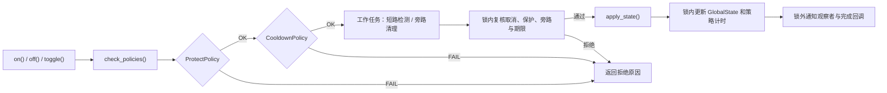
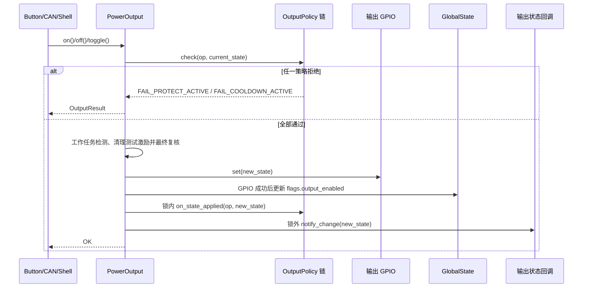
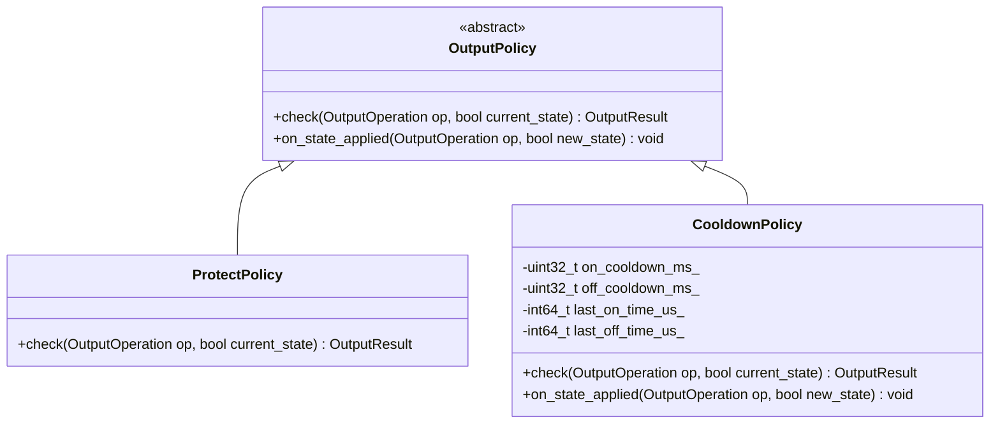

# power_output

功率输出控制模块，以统一事务管理所有 OFF→ON：保护与冷却检查 → 开启前短路检测（保护旁路时跳过）→ 最终复核 → GPIO 提交。关闭立即执行并取消待开启，不受开启策略阻断。

## 模块特点

- **策略链架构**：开关条件以策略对象形式注册，按顺序依次检查，任一策略拒绝即阻止操作
- **可扩展**：继承 `OutputPolicy` 实现自定义策略，调用 `add_policy()` 即可加入检查链
- **保护联动**：内置 `ProtectPolicy`，保护状态激活时自动阻止开启输出，保护触发时强制关闭
- **冷却延时**：内置 `CooldownPolicy`，关闭后再次开启需等待 500ms；关闭不受冷却阻断
- **固定请求容量**：只保留一个检测/开启事务，不积压开启请求；任务和信号量初始化分配，`std::function` 捕获可能分配内存
- **状态回调**：输出状态变更时通知所有注册的回调函数

## 架构与原理







### 策略接口

每个策略需实现两个方法：

| 方法 | 说明 |
|------|------|
| `check(op, current_state)` | 检查操作是否允许，返回 `OutputResult::OK` 或拒绝原因 |
| `on_state_applied(op, new_state)` | 操作执行后的通知，用于更新策略内部状态（如冷却计时器） |

### 内置策略

| 策略 | 文件 | 检查逻辑 | on_state_applied 逻辑 |
|------|------|----------|----------------------|
| `ProtectPolicy` | `protect_policy.hpp` | 仅 ON 操作检查 `protect_should_block_output()`，OFF 始终允许 | 无操作 |
| `CooldownPolicy` | `cooldown_policy.hpp` | ON 操作检查距上次 OFF 的冷却时间，OFF 操作检查距上次 ON 的冷却时间 | 记录对应方向的时间戳 |

### 冷却策略工作方式

冷却时间按操作方向独立设置：

| 常量 | 默认值 | 说明 |
|------|--------|------|
| `OUTPUT_ON_COOLDOWN_MS` | 500 | OFF→ON 冷却：上次 OFF 后多久才能再 ON |
| `OUTPUT_OFF_COOLDOWN_MS` | 0 | ON→OFF 冷却：上次 ON 后多久才能再 OFF |

### 保护联动

初始化时注册保护状态变更回调，当任意保护条件升级为 `PROTECT_STATE_PROTECT` 时，强制关闭输出并通知策略链。

## 文件结构

```
power_output/
├── include/
│   ├── power_output.h          模块 API、枚举、OutputPolicy 基类
│   ├── protect_policy.hpp      保护策略（声明+实现）
│   └── cooldown_policy.hpp     冷却策略（声明+实现）
├── src/
│   └── power_output.cpp        模块核心逻辑
├── CMakeLists.txt
└── README.md
```

## 开启事务与异步接口

`request(op, source, completion)` 用于按键、CAN、ESP-NOW；返回 `PENDING` 仅表示已接收。完成回调恰好执行一次，可能同步调用或在输出工作任务中调用，必须快速返回。回调参数是该请求完成时的输出状态。Web/Shell 使用同步 `on/off/toggle`。所有 source 字符串必须具有静态生命周期。

工作任务 `output_check` 的栈为 4096 字节、优先级 4，空闲时等待通知，不轮询检测。主输出保持关闭，短路检测最多约 3s 预算：先 500ms 初判，未通过则反复“断开 250ms 释放 → 250ms 复测”，任一段 10ms 间隔连续三次电压达标即通过，全程都未通过才判短路；好负载第一段即通过，不增加等待；激励清理成功后才允许开输出。采样间检查取消状态。重复 ON 幂等；检测中重复 ON 返回忙，OFF 或切换请求取消待开启。手动检测也占用同一事务，但不会自动开启。检测错误保持关闭；保护旁路直接跳过采样，冷却仍生效。INA228 是否可用不影响独立短路检测。

输出事务锁覆盖请求状态、策略和 GPIO；检测延时在锁外。`ProtectOutputGuard` 把保护状态/旁路写入与最终检查、GPIO 提交串行化。锁顺序为输出事务 → 保护门控 → GlobalState。策略方法不得重入服务；用户状态/完成回调在锁外执行。关闭始终可用。

`set_event_notifier()` 可在初始化前注册单个轻量输出变化/失败唤醒回调，在事务锁外执行；接收方只唤醒任务，不在回调绘制。`take_failure_notice()` 提供单槽失败通知，屏幕延迟启动也可消费；同类连续失败合并。日志记录来源、判定、电压、阈值和错误；短路状态不扩展现有四通道持久化/通信位域。

## 集成与使用

```cpp
#include "power_output.h"

// 初始化：GPIO 5 输出
PowerOutput::init(GPIO_NUM_5);

// 控制输出
static constexpr char TAG[] = "ExampleCaller";
auto result = PowerOutput::on(TAG);
if (result != PowerOutput::OutputResult::OK) {
    // 处理拒绝原因
}

PowerOutput::off(TAG);
PowerOutput::toggle(TAG);

// 查询状态
bool state = PowerOutput::get_state();

// 注册状态变更回调
PowerOutput::add_on_change_callback([](bool new_state) {
    printf("输出状态: %s\n", new_state ? "ON" : "OFF");
});
```

## 添加自定义策略

继承 `OutputPolicy` 并实现 `check()` 和 `on_state_applied()`，建议以独立 `.hpp` 文件管理：

```cpp
// max_on_time_policy.hpp
#include "power_output.h"
#include "esp_timer.h"

class MaxOntimePolicy : public PowerOutput::OutputPolicy {
public:
    explicit MaxOntimePolicy(uint32_t max_ms) : _max_ms(max_ms) {}

    OutputResult check(OutputOperation op, bool current_state) override {
        // 仅在开启时检查，关闭始终允许
        return OutputResult::OK;
    }

    void on_state_applied(OutputOperation op, bool new_state) override {
        if (new_state) {
            _on_time_us = esp_timer_get_time();
        }
    }

private:
    uint32_t _max_ms;
    int64_t _on_time_us = 0;
};

// 注册策略
static MaxOntimePolicy max_on_policy(5000); // 最长开启 5s
PowerOutput::add_policy(&max_on_policy);
```

## API 参考

`on(source)`、`off(source)` 和 `toggle(source)` 要求调用方传入自身编译期 `TAG`
或局部静态字符串。模块会持久化记录来源、动作、执行结果和最终输出状态。

### `esp_err_t init(gpio_num_t output_gpio)`

初始化模块，配置输出 GPIO。内部自动注册 `ProtectPolicy` 和 `CooldownPolicy`，并监听保护状态变更。冷却时间由 `OUTPUT_ON_COOLDOWN_MS` / `OUTPUT_OFF_COOLDOWN_MS` 常量定义。

### `esp_err_t deinit()`

关闭输出并取消待开启。工作任务、锁和回调保留，以便完成脉冲清理和重新初始化；检测未收尾时拒绝重新初始化。

### `OutputResult on()`

同步开启，最多等待 3500ms。超时取消尚未提交的开启，工作任务仍负责清理，不能在超时后延迟开启。

### `OutputResult off()`

立即关闭，并取消尚未完成的检测/开启；不等待 ADC 检测结束。

### `OutputResult toggle()`

切换输出状态。根据当前状态决定执行 ON 或 OFF 操作，关闭分支立即执行；开启分支进入检测事务。

### `bool get_state()`

返回当前输出状态。

### `void add_on_change_callback(OnOutputChangeCallback cb)`

注册输出状态变更回调，每次状态切换时调用。最多注册 8 个回调。

### `void add_policy(OutputPolicy* policy)`

注册自定义策略到策略链末尾。策略对象的生命周期由调用方管理。最多注册 8 个策略。

### OutputResult 枚举

| 值 | 说明 |
|----|------|
| `OK` | 操作成功 |
| `FAIL_NOT_INIT` | 模块未初始化 |
| `FAIL_PROTECT_ACTIVE` | 保护阻断生效，阻止开启 |
| `FAIL_COOLDOWN_ACTIVE` | 冷却时间未到，阻止开启 |
| `FAIL_SHORT_CIRCUIT` | 检测到短路，保持关闭 |
| `FAIL_SHORT_DETECT` | 检测或测试激励清理失败 |
| `FAIL_BUSY` | 已有检测/开启事务 |
| `FAIL_CANCELLED` | 关闭、保护或反初始化取消 |
| `FAIL_TIMEOUT` | 请求期限/同步等待超时 |
| `FAIL_GPIO` | 主输出 GPIO 操作失败 |
| `PENDING` | 异步请求已接受，尚未完成 |

## 环境与依赖

| 类别 | 要求 |
|------|------|
| 框架 | ESP-IDF v6.0+ |
| RTOS | FreeRTOS |

<!-- dependency-links:start -->
## 依赖导航

工程内直接依赖：

- [`global_state`](../global_state/README.md)（`app`）
- [`protect`](../protect/README.md)（`app`）
- [`short_circuit_detect`](../../middleware/short_circuit_detect/README.md)（`middleware`）
- [`hardware`](../../bsp/hardware/README.md)（`bsp`）
- [`diagnostic_log`](https://github.com/qingmeijiupiao/wireless-power-components/blob/79d506e686ec743ad961ab76c732af96313db54a/components/common/diagnostic_log/README.md)（`common`）

> 本节按当前 `CMakeLists.txt` 的 `REQUIRES` / `PRIV_REQUIRES` 维护。
<!-- dependency-links:end -->

## 输出交互快照与事务日志

`snapshot()` 是非消费式短时加锁接口，包含请求编号、结果、检测中标志、实际输出、保护旁路、四通道阻断位和剩余冷却毫秒。接受请求及所有普通输出请求完成时，在事务锁外唤醒观察者。UI 根据快照判断是否正在检测，不从 ON/OFF 推断。

忙拒绝不覆盖正在执行的请求；OFF 取消后发布新请求状态，旧工作任务的完成结果不能覆盖它。新的开启请求或成功关闭会清理未消费的旧失败通知。同步超时通知只发布一次，工作任务迟到完成清理不会重新弹窗。诊断检测不修改普通输出交互快照。

每个请求由仲裁层记录一次摘要：`id/src/op/前后状态/result/ms/test/test_ms/mv/vmin/min/n/bad/err/bypass/wait/protect`。`ms` 为请求至记录时的总耗时，`test_ms` 为检测调用耗时；`mv/vmin` 为最后一次与窗口内最低有效采样，`n/bad` 为有效/无效采样总数。失败弹窗展示 `vmin`（窗口内最低有效电压）。输出真实变化使用 DEVICE_STATE_I；普通拒绝/取消使用 DEVICE_EVENT_I；幂等成功仅 INFO。短路、检测故障、超时、GPIO 错误使用 WARN，沿用 Hook 的文本加快照机制。策略拒绝不重复 WARN，ADC 瞬时重试为 DEBUG 并汇总到最终结果。底层激励清理错误保留 ERROR，以免 RAII 退出故障静默。
