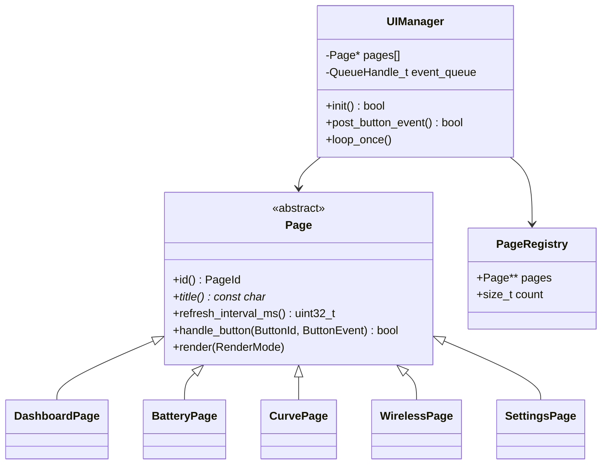
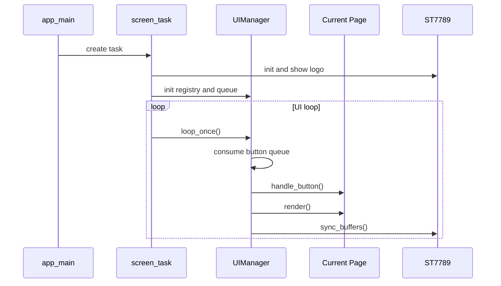
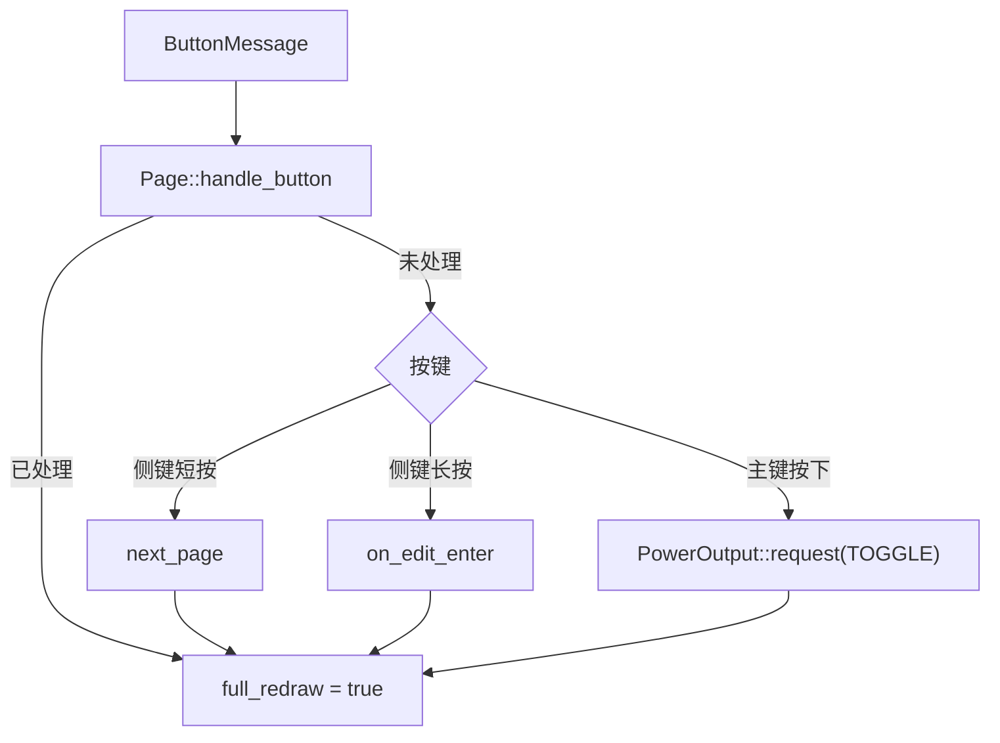
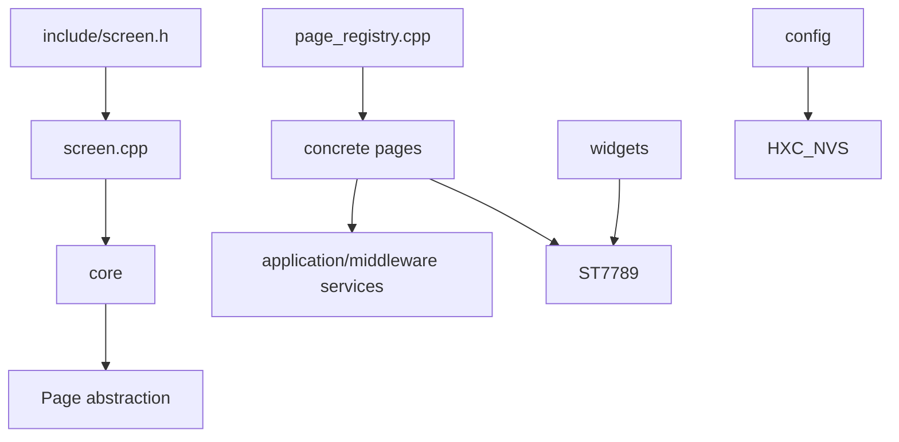

# Screen 架构设计

## 类关系

## 任务时序

页面切换会依次调用旧页面 `on_edit_exit()`、`on_exit()` 和新页面 `on_enter()`。

## 事件分发

页面事件优先于全局默认行为，使 Curve、Wireless 和 Settings 可以复用相同物理按键，
同时避免把页面专属状态写进 `UIManager`。

## 刷新调度

页面通过 `refresh_interval_ms()` 声明目标周期：主页 67ms（约 15 FPS），电量页 250ms，曲线/设置页 200ms，无线页 500ms。`UIManager` 统一管理下一帧截止时间、曲线采样截止时间和 CPU 恢复预算。tick 比较支持计数回绕。

无工作时使用任务通知等待，超时取页面刷新、历史采样及输出反馈截止时间的较早者，不按 5ms 轮询。按键入队、弹窗关闭请求以及输出服务的状态变化/失败通知均唤醒屏幕任务。通知只负责唤醒，数据仍存放在固定按键队列、原子标志、输出快照和失败槽中；生产者恰在准备等待时通知也不会丢失。输出唤醒回调可以在输出初始化前注册，并在事务锁外执行。

按键处理与绘制分开：每轮最多处理队列容量（8）个事件，无视觉变化的事件不要求刷新。切页、编辑或输出变化可以请求提前重绘，但不能绕过 CPU 预算。

`core/ui_schedule.h` 集中定义截止时间与预算规则。每轮按实际处理耗时 W 预留 `ceil(W / 3)` tick 的恢复时间，对应最多 75% 的工作占比目标；计时包含绘制、传输及该轮其他处理，抢占时间也保守计入。恢复期间事件留在队列，不能通过通知洪泛跳过恢复。它替代固定每帧 5ms 休眠；普通空闲等待可由事件提前唤醒。慢帧直接跳到其完成后的下一刷新时隙，不补画过期帧。该预算不是页面必须达到目标 FPS 的保证，实际速度仍受绘制耗时影响。

全局短路提示是静态模态覆盖层：打开时绘制一次页面背景并冻结；仅提示数据变化时重绘弹窗，重复相同失败不重复传输。复用双缓冲复制合成画面，不新增帧缓冲。关闭提示或远程成功开启后请求完整刷新，恢复当前页面自己的周期。

曲线历史有独立的 500ms 截止时间，弹窗静止和离开曲线页时仍采样；采样仍由屏幕任务执行，单次长耗时绘制可造成延迟，不把它当作独立实时采样任务。

## 依赖边界

`UIManager` 不依赖具体页面类型；默认主键处理在消抖后的按下边沿通过 PowerOutput 异步提交输出请求。开启失败的单槽通知由屏幕任务轮询，调用公共 `short_circuit_dialog` 在所有页面之上绘制；弹窗优先消费按键。注册表负责组装页面，具体页面可依赖业务服务，widgets只负责绘图和格式化。

## 输出反馈分层

`PowerOutput::Status` 是业务快照；`core/output_feedback.h` 只负责状态映射、提示有效期与下次更新间隔，不调用输出控制；`widgets/output_view.h` 是不依赖业务服务的显示数据；`ui_chrome` 根据显示数据绘制胶囊、紧凑图标和底栏提示。UIManager 在处理按键后刷新显示快照，页面不维护自己的检测状态机。

主键以消抖后的 PRESS 作为短按动作：立即触发页面动作或输出切换，不等待 250ms 双击窗口；RELEASE 结束按下高亮。双击/长按事件不绑定也不消费，OTA 确认使用两次按下。页面处于编辑/覆盖层时不高亮输出控件。输入丢失时按下效果有有界过期时间，避免永久高亮。

CHECK/WAIT 有 100ms 更新截止时间；主页复用正常页面帧，低刷新率页面可临时增加状态帧。离开过渡状态后恢复各页周期，不改变页面配置。电量、曲线页状态点使用同一显示数据；其他页面通过临时底栏展示检测和操作原因，不改动原有布局。静态故障弹窗仍冻结背景和状态动画，保留历史采样。
