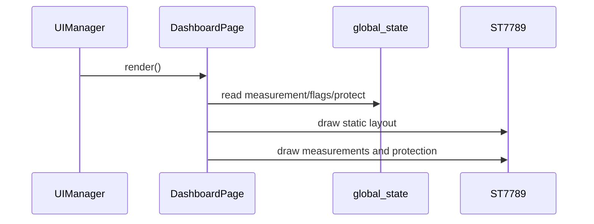

# Dashboard 页面

显示实时电压、电流、功率、板温、运行时间、输出状态和四路保护状态。

页面目标为约 15 FPS（67ms）整屏刷新，不处理专属按键；主键短按由 UIManager 统一切换输出。

## 数据与显示

| 区域 | 数据来源 | 单位/行为 |
|---|---|---|
| 电压 | `GlobalState::voltage_mV` | mV 转 V，显示 3 位小数 |
| 电流 | `GlobalState::current_uA` | 取绝对值，μA 转 A，最多五位数字、三位小数 |
| 功率 | 电压 × 电流 | 实时计算 W，最多五位数字、三位小数 |
| 温度 | `board_temperature` | 0.01℃ 转 ℃ |
| 输出 | `flags.output_enabled` | ON/OFF 色块 |
| 保护 | `protect_states` | NORMAL 隐藏，WARNING/PROTECT 显示标签 |

OVP 正常时会改为显示 UVP 状态，使有限的右侧空间能够覆盖过压和欠压两种状态。
