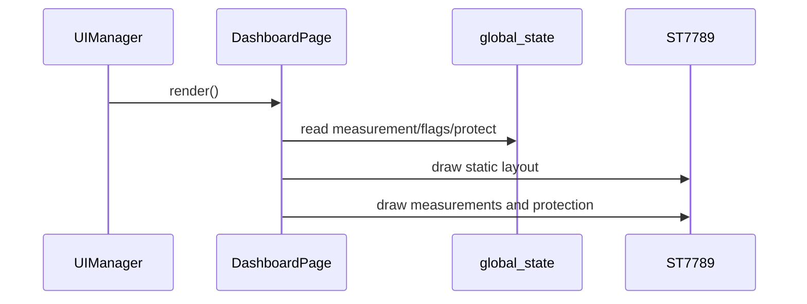

# Dashboard 页面

显示实时电压、电流、功率、板温、运行时间、输出状态和四路保护状态。

页面目标为约 15 FPS（67ms）整屏刷新，不处理专属按键；主键短按由 UIManager 统一切换输出。

## 数据与显示

| 区域 | 数据来源 | 单位/行为 |
|---|---|---|
| 电压 | `GlobalState::voltage_mV` | mV 转 V，显示 3 位小数 |
| 电流 | `GlobalState::current_uA` | 取绝对值，μA 转 A，最多五位数字、三位小数 |
| 功率 | 电压 × 电流 | 实时计算 W，最多五位数字、三位小数 |
| 温度 | `board_temperature` | 0.01℃ 转 ℃ |
| 输出 | `PowerOutput::snapshot()` 经 OutputFeedback 映射 | 72×23 状态胶囊 |
| 保护 | `protect_states` | NORMAL 隐藏，WARNING/PROTECT 显示标签 |

OVP 正常时会改为显示 UVP 状态，使有限的右侧空间能够覆盖过压和欠压两种状态。

## 输出状态胶囊

保留大号电压电流和右侧保护栏。底部功率附 W，温度保留 `T` 徽标并附 C；右下 `(162,110)` 放置 72×23 输出胶囊。胶囊内部为纯黑，仅保留状态色边框、状态点和文字。

- OFF：灰色；ON：绿色；CHECK：黄色三点指示，约 100ms 一步；WAIT/INIT：黄色；LOCK/ERR：红色。颜色之外始终保留文字。
- 主按键消抖后立即高亮白色边框并提交输出切换，不再等待 250ms 双击判定窗口；释放后高亮保留到约 300ms 或下一次按键事件。
- 关闭输出立即显示 OFF，即使 OFF→ON 冷却计时尚未结束也不显示 WAIT；只有冷却期内尝试开启被拒时才显示 `WAIT 0.xs`。保护拒绝显示通道原因，其余失败显示具体简短原因。提示临时替换底部功率、温度区域，通常保留 2 秒；冷却提示随冷却结束消失。
- 冷却或保护恢复后保持 OFF，必须重新请求开启。GPIO 关闭失败时仍按实际状态显示 ON，并提示 OUTPUT ERROR。
- 胶囊蓝色下划线表示保护旁路，与 ON 的绿色独立。
- 短路/检测故障/超时仍使用全局确认弹窗；关闭弹窗的按键不会传给输出切换。

主页正常目标仍为约 15 FPS；按键/状态变化可提前重绘，CHECK 动画复用正常页面帧，不额外按 10Hz 重画主页。
