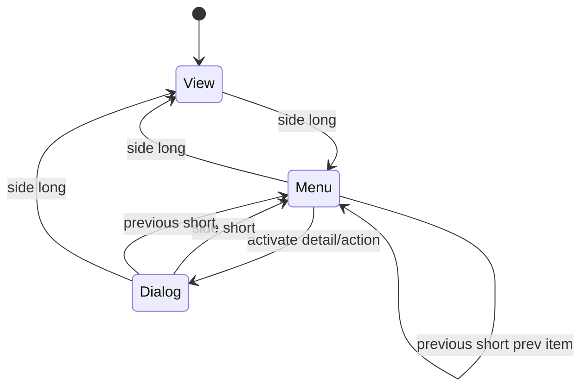
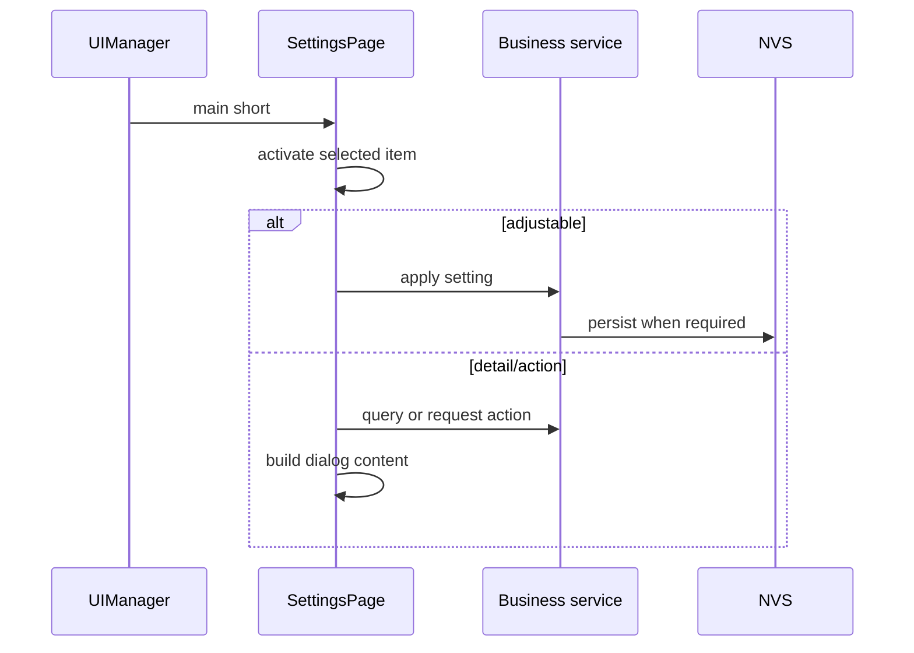
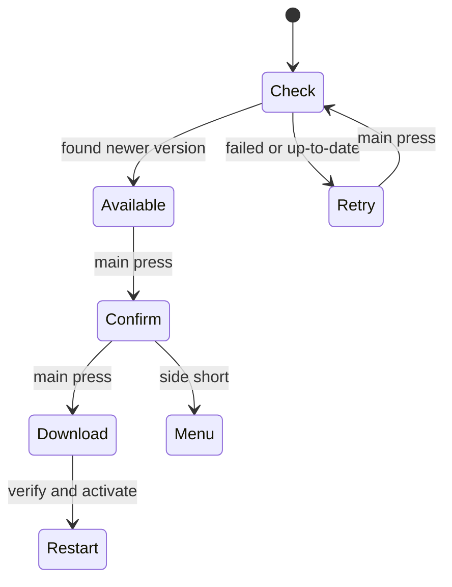

# Settings 页面

设置页包含 View、Menu、Dialog 三种状态，固定显示当前项及前后各一项。

设置业务分为显示、连接和系统诊断三类。所有修改通过对应服务公开接口完成；主按键以按下边沿触发，OTA 使用两次按下确认升级的二阶段操作，避免误触。菜单内上下翻页键分别前进/回退设置项，详情或动作弹窗中两者都可返回菜单。

## 设置项

| 设置项 | 类型 | 持久化/服务 |
|---|---|---|
| Rotation、Brightness | 可调 | `display_config` / NVS |
| Web server at boot、Protection、Blackbox snapshot | 可调 | 对应应用服务 |
| ESP-NOW pairing、Firmware update | 动作 | ESP-NOW / OTA 异步服务 |
| ESP-NOW information、Firmware information、Blackbox information、Calibration | 详情 | 只读查询 |
| CAN baud rate、CAN termination | 可调 | CAN NVS / 终端电阻服务 |

## OTA 确认流程

弹窗固定使用四行、每行 27 个可见字符的缓冲区，构建内容时必须使用有长度限制的
`snprintf`。设置页在 `on_enter()` 中重新读取旋转和背光配置，避免其他入口修改后显示旧值。
