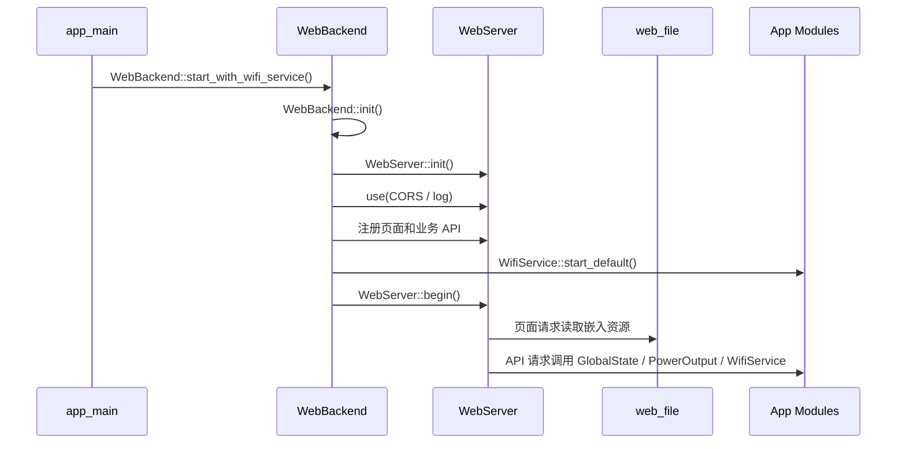

# web_backend

`web_backend` 是设备 Web 后端应用层组件，负责集中注册控制页、配网页和业务 API。底层 HTTP 路由、中间件和请求体读取由 `WebServer` 提供，静态页面资源由 `web_file` 嵌入固件。

## 模块特点

- **集中注册路由**：所有页面和 API 在 `WebBackend::init()` 中注册。
- **按职责拆分实现**：生命周期与路由注册、页面响应、业务 API、日志捕获、JSON 请求解析分别维护在独立源文件中。
- **双页面入口**：主页面用于查看设备状态和控制输出；配网页用于写入 STA WiFi 凭据。
- **设备状态 API**：读取电压、电流、功率、温度、保护状态、输出状态和 WiFi 状态。
- **输出控制 API**：Web 层直接调用 `PowerOutput::on/off/toggle`，输出保护和冷却规则只维护在 `PowerOutput` 策略链中。
- **WiFi 配网 API**：通过 `WifiService` 扫描附近 AP、保存 STA 凭据、切换 AP 配网和查询 WiFi 状态。
- **ESP-NOW 配对 API**：开启单设备配对窗口、主动退出配对并清除已保存 peer。
- **OTA 升级 API**：流式接收 APP 固件，写入备用分区并校验；用户确认后切换启动分区并重启。
- **黑匣子 API**：分页读取持久化记录、解析版本化快照、导出历史记录、清空分区和设置周期快照。
- **Captive Portal 支持**：AP 配网模式下，未匹配路径可回落到配网页。
- **请求来源审计**：通过 `ESP_LOGI` 记录客户端 IPv4、HTTP 方法和 URI，使串口与 RAM 实时日志一致；写请求额外写入持久化黑匣子。
- **嵌入式内存策略**：响应使用固定静态缓冲，JSON 请求通过 jsmn token 按字段提取，避免构造完整 JSON DOM。

## 源码结构

| 文件 | 职责 |
|------|------|
| `include/web_backend.h` | 对外公开 API，只暴露初始化、启动、停止和运行状态查询 |
| `private_include/web_backend_internal.h` | 组件内部接口，供多个源文件共享 handler 声明和固定响应缓冲 |
| `src/web_backend.cpp` | 生命周期管理、CORS 中间件、页面/API 路由注册和 404/Captive Portal 回落 |
| `src/page_handlers.cpp` | HTML/CSS 静态资源响应 |
| `src/api_handlers.cpp` | 业务 REST API handler，调用 `PowerOutput`、`WifiService`、`protect` 等应用模块 |
| `src/log_capture.cpp` | ESP 日志捕获、RAM 环形缓冲和请求日志中间件 |
| `src/request_json.cpp` | 请求 JSON 字段读取，基于 jsmn token 接口 |
| `src/ota_handlers.cpp` | OTA 状态、固件流式上传、二次确认激活、远端版本检查与在线升级接口 |
| `src/rtos_stats_api.cpp` | 按需采样 FreeRTOS 任务运行时间并返回 CPU、栈余量和任务状态 |

`private_include` 只通过 `PRIV_INCLUDE_DIRS` 加入本组件编译，不作为跨组件公共头文件使用。其他组件应只包含 `web_backend.h`。

## 内存与 JSON 策略

Web 后端运行在 ESP32-C6 上，RAM 和任务栈都有限，因此当前实现遵循以下约束：

- 响应正文共用一块 8KB `web_scratch_buffer`。WebServer 串行分发请求，handler 返回前已完成发送，后台任务不得保存该缓冲指针。
- 拼接长 JSON 响应时使用带边界检查的追加函数，缓冲不足时返回 `response_too_large`。
- 请求 JSON 使用 jsmn 写入固定 token 数组，不构造 DOM，只提取 handler 关心的顶层字段。
- HTTP 请求体不进入日志；业务 handler 只记录必要字段。SSID 可以记录，WiFi 密码禁止记录。
- OTA 固件上传通过 `WebServer::stream_body()` 复用 `web_scratch_buffer` 流式写入分区，不缓存完整固件。
- 字符串字段复制到调用方提供的固定长度数组，例如 WiFi SSID/password。
- 输出 JSON 仍使用 `snprintf` 手动生成，避免引入运行期堆分配和更大的代码体积。

## OTA 黑匣子诊断

OTA 上传、校验、激活和中止流程会显式写入黑匣子。关键事件包含 OTA 状态、已写入长度、
固件总长度、运行/启动/目标槽位，以及失败时的错误名称和十六进制错误码。

OTA 诊断统一使用轻量文本事件，不附加结构化状态快照。上传期间额外在 `25%`、`50%`、
`75%` 三个检查点记录进度，避免按 `4KB` 分块写入时产生大量 Flash 日志；上传完整接收和
镜像校验结果仍分别记录。

对 Web 技术不熟悉时可以按下面理解：

- **路由**：URL 路径和处理函数的绑定，例如 `/api/state` 绑定到状态查询 handler。
- **handler**：真正处理一次 HTTP 请求的函数，负责读取请求、调用业务模块、返回响应。
- **middleware**：进入 handler 前统一执行的函数，适合做 CORS、请求日志、鉴权等公共逻辑。
- **CORS/OPTIONS**：浏览器跨来源调用 API 前可能发送的预检请求，本组件统一返回允许的请求方法和 Header。
- **JSON token**：解析器将 key/value 位置写入固定数组，不生成完整对象树，更适合嵌入式设备。

## 路由表

| 路径 | 方法 | 说明 |
|------|------|------|
| `/` | GET | STA 模式返回主页面，AP 配网模式返回配网页 |
| `/index.html` | GET | 返回主页面 |
| `/charts.html` | GET | 返回趋势曲线页面 |
| `/control.html` | GET | 返回控制设置页面 |
| `/status.html` | GET | 返回状态诊断页面 |
| `/logs.html` | GET | 返回实时日志页面 |
| `/blackbox.html` | GET | 返回历史日志页面 |
| `/firmware.html` | GET | 返回固件升级页面 |
| `/app.css` | GET | 返回 Web 公共样式 |
| `/provision` | GET | 返回配网页 |
| `/provision.html` | GET | 返回配网页 |
| `/api/state` | GET | 返回设备状态、保护状态、输出状态和 WiFi 状态 |
| `/api/meter/reset` | POST | 重置屏幕与 Web 共用的电量计量基线和计量时间 |
| `/api/output` | POST | 设置或切换输出状态 |
| `/api/short/test` | GET/POST | 执行一次诊断短路检测，只测量、不提交输出状态 |
| `/api/reboot` | POST | 延迟 300ms 后重启设备 |
| `/api/system` | GET | 返回硬件版本、固件版本、当前 APP 分区、MAC 地址、构建时间和运行时间 |
| `/api/backlight` | GET/POST | 查询或设置屏幕背光亮度 |
| `/api/start-logo` | GET/POST | 查询或设置开机画面显示时长，`duration_ms=0` 表示关闭 |
| `/api/protect` | GET/POST | 查询保护详情、开启/关闭保护功能，或更新持久化保护阈值 |
| `/api/can` | GET/POST | 查询或设置 CAN 波特率和设备 ID |
| `/api/calibration` | GET/POST | 查询或更新电流校准参数（K 值、温漂、插值点位） |
| `/api/diagnostics` | GET | 查询 INA228 原始寄存器等诊断数据 |
| `/api/rtos/stats` | GET/POST | 查询或配置任务运行统计采样 |
| `/api/logs` | GET | 按 `since` 增量读取最近 8KB 实时 ESP 日志 |
| `/api/logs/clear` | POST | 清空实时日志缓冲区 |
| `/api/blackbox` | GET | 按 `start` 原始记录游标和 `limit` 逻辑记录数分页读取持久化日志 |
| `/api/blackbox/clear` | POST | 清空黑匣子持久化日志；完成后保留 reset 标记 |
| `/api/blackbox/config` | POST | 设置周期快照间隔，`snapshot_interval_s=0` 表示关闭 |
| `/api/wifi/status` | GET | 返回 WiFi 模式、IP、信道、MAC 和 ESP-NOW 运行期诊断 |
| `/api/espnow/pair` | POST | 无时间限制开启单设备配对，成功配对或手动停止后退出 |
| `/api/espnow/pair/stop` | POST | 手动退出当前配对窗口 |
| `/api/espnow/pair/clear` | POST | 退出配对并清除全部已保存 ESP-NOW peer |
| `/api/wifi/scan` | GET | 扫描附近 WiFi AP，返回 SSID、RSSI、信道和认证类型 |
| `/api/wifi/on` | POST | 按 NVS 配置启动 WiFi/Web |
| `/api/wifi/connect` | POST | 保存并连接 STA WiFi |
| `/api/wifi/ap` | POST | 切换到 AP 配网模式 |
| `/api/wifi/off` | POST | 关闭 IP 网络并进入 `ESPNOW_ONLY`，保留 ESP-NOW |
| `/api/wifi/boot` | POST | 设置启动时是否自动启用 WiFi/Web |
| `/api/wifi/clear` | POST | 清除已保存的 STA 凭据 |
| `/api/ota/status` | GET | 查询 OTA 状态、备用分区容量、已写入长度和待升级版本 |
| `/api/ota/upload` | POST | 以 `application/octet-stream` 流式上传 APP 固件，写入备用分区并校验 |
| `/api/ota/activate` | POST | 激活已校验固件，切换启动分区并延迟重启 |
| `/api/ota/abort` | POST | 中止上传或放弃尚未激活的待升级固件 |
| `/api/ota/remote/check` | GET | 通过 jsDelivr 清单异步检查最新版本，仅接受高于当前版本的更新 |
| `/api/ota/remote/download` | POST | 通过 jsDelivr 异步在线升级；连接中断时使用 HTTP Range 自动续传，成功后自动重启 |

## 集成方式

```cpp
#include "web_backend.h"

WebBackend::start_with_wifi_service();
```

`start_with_wifi_service()` 始终先启动 `WifiService`。`web_boot=0` 时进入
`ESPNOW_ONLY` 且不启动 HTTP；其他模式再初始化 WebBackend。

设备对外访问地址由当前 WiFi 模式决定：

- STA 模式：使用 `WifiService::get_ip()` 获取路由器分配的 IP。
- AP 配网模式：使用 `WifiService::get_ip()` 获取 AP 配网 IP，该地址由 `wifi_service.h` 中的 `AP_IP_OCTET*` 常量定义。
- ESPNOW_ONLY：无 IP 和 HTTP 服务，WiFi STA 射频仅供 ESP-NOW 使用。

## API 示例

### GET `/api/state`

返回当前测量数据、输出状态、保护状态和 WiFi 状态。

```json
{
  "voltage_v": 7.651,
  "current_a": 0.000,
  "power_w": 0.000,
  "board_temp_c": 34.27,
  "chip_temp_c": 33.50,
  "energy_mwh": 12.345,
  "charge_mah": 1.234,
  "meter_time_ms": 41005,
  "output_on": false,
  "protect_bypassed": false,
  "uptime_ms": 41005,
  "protect": {
    "otp": 0,
    "ovp": 0,
    "uvp": 0,
    "ocp": 0
  },
  "wifi": {
    "mode": "sta",
    "state": 1,
    "ip": "<device-ip>",
    "ap_ssid": "<provision-ap-ssid>",
    "sta_mac": "<sta-mac>",
    "ap_mac": "<ap-mac>",
    "boot_enabled": true,
    "last_error": "none"
  }
}
```

### POST `/api/output`

请求：

```json
{"state": true}
```

响应：

```json
{
  "ok": true,
  "reason": "ok",
  "output_on": true
}
```

`reason` 来自统一 `PowerOutput::result_to_string()`，包括 `protect_active`、`cooldown_active`、`not_initialized`、`short_circuit`、`short_detect_failed`、`busy`、`cancelled`、`timeout` 和 `gpio_failed`。接口等待最终结果，最多等待 3500ms；超时取消尚未提交的开启。

### GET/POST `/api/short/test`

只运行一次短路检测（诊断输出事务），**绝不开启主输出**，用于远程验证检测稳定性。

响应：

```json
{
  "ok": true,
  "is_short": true,
  "voltage_mV": 0,
  "min_voltage_mV": 0,
  "threshold_mV": 200,
  "sample_count": 176,
  "invalid_count": 0,
  "duration_ms": 3010
}
```

主输出已开启或已有输出事务时返回 `{"ok":false,"reason":"busy"}`。字段对应检测组件 `ShortCircuitDetect::Result`；`is_short` 为真表示各段都未达标。该接口走诊断事务，不发布普通输出状态、失败弹窗和保护/计量快照。

### GET `/api/wifi/status`

响应：

```json
{
  "mode": "sta",
  "state": 1,
  "ip": "<device-ip>",
  "saved_ssid": "<saved-ssid>",
  "ap_ssid": "<provision-ap-ssid>",
  "rssi": -41,
  "signal_percent": 100,
  "channel": 6,
  "channel_available": true,
  "sta_mac": "<sta-mac>",
  "ap_mac": "<ap-mac>",
  "boot_enabled": true,
  "last_error": "none"
}
```

### POST `/api/wifi/connect`

请求：

```json
{
  "ssid": "<ssid>",
  "password": "<password>"
}
```

连接成功后保存到 NVS；失败时回到 AP 配网模式。

### GET `/api/wifi/scan`

响应：

```json
{
  "ok": true,
  "count": 2,
  "aps": [
    {"ssid": "Example", "rssi": -41, "channel": 6, "auth": "wpa2", "secure": true},
    {"ssid": "OpenWifi", "rssi": -70, "channel": 11, "auth": "open", "secure": false}
  ]
}
```

扫描由用户在配网页触发。AP 配网模式下底层使用 APSTA，扫描期间配网热点保持运行，但无线链路可能有短暂延迟。

### POST `/api/wifi/ap`

切换到 AP 配网模式。响应中的 `ip` 来自 `WifiService::get_ip()`，不应在调用方写死。

### POST `/api/wifi/off`

停止 DNS 劫持和 Captive Portal，关闭 IP 网络服务并进入 ESPNOW_ONLY，保留供 ESP-NOW 使用的 STA 射频。

### GET/POST `/api/calibration`

GET 返回电流校准参数快照（`current_base_k`、`sample_resistance_mohm`、`temperature_k`、`base_temperature_c` 和 6 个点位）。POST 支持校准写入，可单独或组合提交字段，至少提供一项操作：

| 字段 | 类型 | 说明 |
|------|------|------|
| `base_k` | uint32 | 直接写入 K，范围 1-65535 |
| `real_current_ma` | uint32 | 按真实电流和当前 shunt 原始值绝对值自动计算 K：`K = real_uA / |register_raw|`，范围 1-100000 mA |
| `temperature_k` | int32 | 直接写入温漂系数，范围 -32767~32767 ppm/℃ |
| `temp_display_current_ma` + `temp_real_current_ma` | uint32 | 按当前板温和实测电流自动计算温漂系数 |
| `point_index` + `point_register_raw` + `point_real_current_ma` | uint32 | 用当前 K 计算并写入插值点，`point_index` 为 0-5 |
| `reset_secondary` | bool | 清除插值点与温漂系数，保留 K |

自动计算 K 时，后端读取 `GlobalState.current_register_raw`；该值为 0 时返回 `register_raw_unavailable`，要求先让负载稳定工作。原始值允许为负，取绝对值计算，兼容采样方向反向的接线。所有输入都会做范围检查，失败返回 `{"ok":false,"reason":"..."}` 和 HTTP 400。

请求示例：

```json
{"real_current_ma": 1230}
```

响应示例：

```json
{"ok":true,"reboot_required":true,"computed_base_k":1114,"computed_temperature_k":0,"temperature_computed":false,"current_base_k":1114,"sample_resistance_mohm":2.244,"temperature_k":0,"base_temperature_c":35.00,"points":[]}
```

校准参数写入 NVS，但 LP 核只在启动时加载，因此响应始终带 `reboot_required:true`；前端在保存后应提示用户重启。K 值校准是复刻设备的必做项，其余项可选。

## 请求流程



## 注意事项

- Web 输出控制不复制保护逻辑，必须通过 `PowerOutput` 执行。
- 配网页提交的 SSID/password 只在 `WifiService::connect_sta(..., true)` 成功后写入 NVS。
- 配网页保留手动输入 SSID 兜底，扫描只用于辅助选择。
- 不要在 README 或前端调用方写死设备 IP；统一通过 API 返回值或 `WifiService::get_ip()` 获取。
- 路由路径属于 Web 后端接口契约，修改时需要同步前端页面和 README。
- 新增内部函数优先放在现有职责文件中；只有跨源文件共享的声明才放入 `private_include/web_backend_internal.h`。
- 新增 API 请求体字段时优先复用 `request_json.cpp` 的轻量字段读取工具，避免重新写字符串查找逻辑。
- 新增响应时优先估算最大响应长度，并确认不会超过共用的 8KB Web 缓冲。
- OTA 上传使用原始二进制请求体，不使用 `multipart/form-data`；浏览器文件选择体验不受影响。
- OTA 上传完成后只校验固件，必须由用户通过 `/api/ota/activate` 二次确认后才切换启动分区。

<!-- dependency-links:start -->
## 依赖导航

工程内直接依赖：

- [`blackbox_service`](../blackbox_service/README.md)（`app`）
- [`diagnostic_log`](../../common/diagnostic_log/README.md)（`common`）
- [`can_callback`](../can_callback/README.md)（`app`）
- [`current_calibration`](../current_calibration/README.md)（`app`）
- [`espnow_service`](../espnow_service/README.md)（`app`）
- [`global_state`](../global_state/README.md)（`app`）
- [`ota_service`](../ota_service/README.md)（`app`）
- [`power_output`](../power_output/README.md)（`app`）
- [`protect`](../protect/README.md)（`app`）
- [`screen`](../screen/README.md)（`app`）
- [`wifi_service`](../wifi_service/README.md)（`app`）
- [`energy_meter`](../../middleware/energy_meter/README.md)（`middleware`）
- [`espnow_link`](../../middleware/espnow_link/README.md)（`middleware`）
- [`ota_manager`](../../middleware/ota_manager/README.md)（`middleware`）
- [`WebServer`](../../middleware/WebServer/README.md)（`middleware`）
- [`hardware`](../../bsp/hardware/README.md)（`bsp`）
- [`st7789_driver`](../../bsp/st7789_driver/README.md)（`bsp`）
- [`web_file`](../../assets/web_file/README.md)（`assets`）

> 本节按当前 `CMakeLists.txt` 的 `REQUIRES` / `PRIV_REQUIRES` 维护。
<!-- dependency-links:end -->
