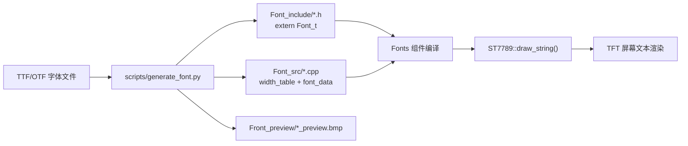

# Fonts

PRO V2 新增 `DENGB28_NUM` 数字子集（27px字高）：仅保存 `0123456789.-+`，
位图5,400字节。仍使用95项ASCII宽度表，缺失字符宽度为0、无位图数据。
UI大数字绘制会检查字形支持，不支持的字符串回退到完整小字号字库。
生成命令和预览检查见 `components/app/screen/DOC/pro_v2_ui.md`。

点阵字体资源模块，提供 DENGB 字体家族的多种字高变体（12/16/20/默认），以编译期常量数组形式存储字形灰度数据和宽度表，供 `st7789_driver` 渲染文本。

## 模块特点

- **统一基线变宽**：每个字符使用独立宽度表，但共享同一条排版基线，正确保留 `g` / `p` / `q` / `y` 等字母的下伸部分
- **多字高预置**：DENGB12 / DENGB16 / DENGB20 / DENGB（15px）
- **预览位图**：`Front_preview/` 目录含各字体的渲染预览 BMP

## 生成与渲染流程



## 文件结构

```
Fonts/
├── Font_include/   # 头文件，提供 Font_t 外部引用及字高常量
├── Font_src/       # .cpp 源文件，含字形宽度表与像素数据
└── Front_preview/  # BMP 预览图 + TTF 源字体文件
```

## 集成与使用

```cpp
#include "DENGB16.h"

ST7789::draw_string(0, 0, "Hello", ST7789::WHITE, ST7789::BLACK, DENGB16);
```

## 字体生成工具

使用 `scripts/generate_font.py` 从 TTF/OTF 字体文件生成兼容 `Font_t` 格式的 C++ 头文件、源文件及预览位图。

### 环境准备

```bash
pip install -r scripts/requirements.txt
```

### 用法

```bash
python scripts/generate_font.py <字体文件> <字体大小> <字体名称>
```

| 参数 | 说明 |
|------|------|
| `字体文件` | TTF/OTF 字体文件路径 |
| `字体大小` | 渲染字号（像素），如 12、16、20 |
| `字体名称` | 生成的 C++ 标识符名，如 `DENGB16` |

### 示例

```bash
# 在项目根目录执行，输出到 Fonts/DENGB16/ 目录
python scripts/generate_font.py Fonts/Front_preview/DENGB.TTF 16 DENGB16
```

生成结果：

```
DENGB16/
├── DENGB16.h           # 放入 Font_include/
├── DENGB16.cpp         # 放入 Font_src/
└── DENGB16_preview.bmp # 放入 Front_preview/
```

生成后需手动将 `.h` / `.cpp` / `_preview.bmp` 移至对应目录，并在 `CMakeLists.txt` 的 `SRC_DIRS` / `INCLUDE_DIRS` 覆盖范围内。

### 生成格式说明

- 字符范围：ASCII 32–126（共 95 个可打印字符）
- 每字符像素数据：`font_height × advance_width` 字节，灰度值 0–255
- 字体高度：根据整套字符相对统一基线的最大上伸和下伸范围计算，不再逐字符贴底对齐
- 预览图：每行包含一条灰色基线，便于检查下伸字母和符号的垂直位置
- 渲染时 `st7789_driver` 对灰度值做 RGB565 插值，实现抗锯齿效果

## 环境与依赖

<!-- dependency-links:start -->
## 依赖导航

工程内直接依赖：

- [`st7789_driver`](../../bsp/st7789_driver/README.md)（`bsp`）

> 本节按当前 `CMakeLists.txt` 的 `REQUIRES` / `PRIV_REQUIRES` 维护。
<!-- dependency-links:end -->
