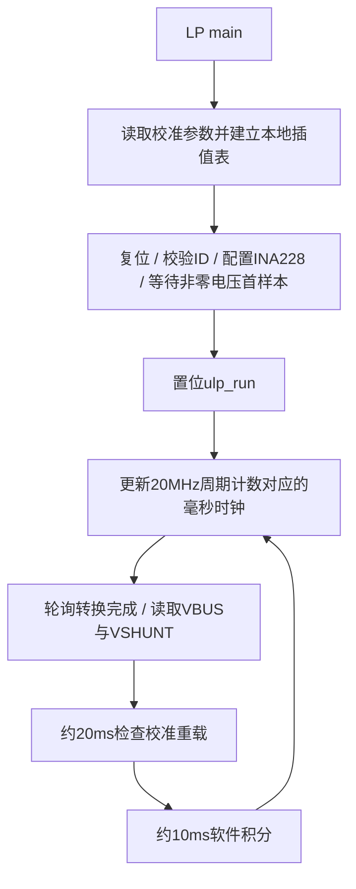

# ulp_app

ESP32-C6 LP Core 独立固件：通过LP I2C轮询INA228，执行整数电流校准、温漂补偿和软件积分，将结果放入RTC共享区。HP加载与快照接口见 [ulp_loader](../ulp_loader/README.md)。

## 执行流程



初始化及异常恢复持续重试，当前没有每秒循环频率统计任务。`app_loop_every_ms` 使用 `>`，以上周期是调度目标，不是严格定时中断。

## INA228配置

| 项目 | 当前代码 |
|---|---|
| 地址 | 0x40，LP I2C 400kHz，HP侧配置GPIO6/7 |
| ID | manufacturer=0x5449，device按0xFFF0掩码匹配0x2280 |
| CONFIG | 0x0000，ADCRANGE=0 |
| ADC_CONFIG | 连续VBUS/VSHUNT/TEMP；三路1052μs转换时间，64次平均 |
| 转换完成 | DIAG_ALRT的CNVRF（bit1） |
| 采样 | 读取VBUS/VSHUNT的24位寄存器，取其中20位有效值 |

没有使用INA228内置CURRENT、POWER、ENERGY或CHARGE结果完成产品计量。不能将HP的5ms发布周期或屏幕刷新周期视为芯片新样本周期。

## 换算与校准域

```text
voltage_uv = unsigned20(VBUS) * 3125 / 16
voltage_register_raw = uint16(voltage_uv / 1250)
shunt_register_raw = int16(signed20(VSHUNT) / 8)
```

原生VBUS单位为195.3125μV，当前宽量程VSHUNT单位为312.5nV。
兼容诊断电压单位为1.25mV，兼容校准分流单位为2.5μV；名称中的raw不是INA228原生20位结果。
保留兼容域是为了沿用现有NVS校准结构和接口，不能只修改除数而不迁移所有消费者。

电流先判断 `abs(raw * K) < 5000μA`，满足则归零；否则执行：

```text
I = raw * K + interpolate(raw) * 100μA
delta_temp = (Board_temperature - 3500) / 100
I_final = I - (I / 1000) * temperature_K * delta_temp / 1000
```

使用6点整数插值，负输入奇对称，范围外取边界偏移。校准参数来自 `CurrentCalib.h`。
HP在共享锁内下发参数并置重载位；LP在同一临界区读/清标志，复制参数后在锁外重建插值表。板温由HP提供，单位0.01℃。

## 共享区与快照

| 字段 | 类型 | 语义 |
|---|---|---|
| ulp_state | uint32_t | 状态位 |
| shared_lock | ulp_lp_core_spinlock_t | 跨核短临界区 |
| log_data | uint32_t | 预留日志数据 |
| voltage_uv | uint32_t | μV |
| current_uA | int32_t | 校准后有符号μA |
| voltage_register_raw | uint16_t | 1.25mV/单位兼容值 |
| shunt_register_raw | int16_t | 2.5μV/单位兼容值 |
| ina228_manufacturer_id | uint16_t | 厂商ID |
| Board_temperature | int32_t | HP写入的0.01℃板温 |
| meter_uah / meter_uwh | int64_t | 本次LP启动以来的有符号整数累计 |
| current_calib_params | CurrentCalib::params_t | HP写入的校准参数 |

I2C和计算在锁外，`publish_sample` 在同一临界区提交完整电压/电流/兼容raw。HP通过loader读取快照，不能直接读取零散共享变量；64位累计也必须保护。

## 积分与异常恢复

软件积分保留带符号余数：μAh除数为3600000（μA·ms），μWh除数为3600000000000（μA·μV·ms）。HP的EnergyMeter另维护可重置会话基线，LP不承担掉电持久化。

连续超过1000ms无完整样本时置 `ulp_ina228_read_timeout`，保留旧显示值并阻塞重试初始化。恢复阶段置 `ulp_i2c_init_err`，首个非零电压有效样本恢复后清除错误与超时标志，并置初始化成功位。HP据此暂停OVP/UVP/OCP阻断，OTP独立工作；不是清零后触发UVP关断。

`update_meter` 遇到无效状态时跳过积分并更新时间基准。但阻塞恢复期间不执行正常积分调度，长时间中断后的积分间隔仍需专项验证，不能保证恢复窗口已被该分支完全排除。

## 已知边界与扩展要求

- 首样本就绪要求电压非零；0V输入不满足当前初始化退出条件。
- 分流兼容值仍为int16，`/8`后再窄化并未限幅；HP电压也只有uint16 mV。扩大实际量程前需同步校准结构、通信字段与日志。
- `ulp_run` 是运行状态，不是心跳或样本新鲜度计数器。
- 时钟换算依赖loader选择20MHz LP时钟；修改时钟需同时修改LP计时。
- 新增计算需检查LP 8192字节保留区、整数乘积溢出、周期和共享锁时长。

文件职责：`ina228.hpp`为寄存器访问，`ulp_main.cpp`为采样/积分，`ulp_Interp.hpp`为整数插值，`ulp_state.h`为共享状态位。
